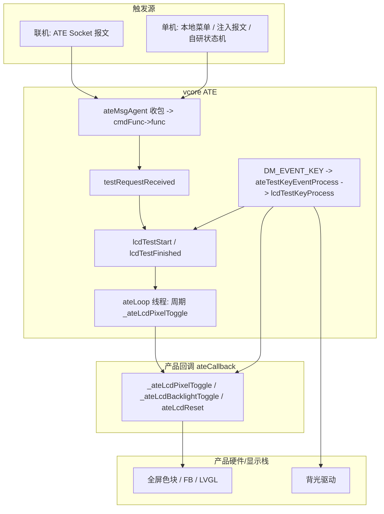

+++
title = 'ATE-01 单机产测框架与界面（有屏 LVGL / 无屏 headless / vcore 参考实现）'
date = 2026-09-16T10:00:00+08:00
draft = false
weight = 1
tags = ['嵌入式', 'ATE 产测', 'LVGL', 'BK7258 平台', '调试排障']
series = 'ATE 产测实战'
+++

三次。只要在小屏机型的单机 ATE 主菜单里连按三次 Down，UsageFault 就准时登场，崩溃线程一栏端端正正写着 lvgl——那一瞬间我盯着串口，怀疑是按键在报复我。同期 V50E 的版本检查硬件版本号（问题单 #1）也死活不肯通过。这两桩悬案，加上一份来自另一平台的 vcore 参考实现，凑成了下面这篇记录。

## 概述

本篇汇总 BK7258 AVDK SMP 平台上单机产测（Standalone ATE）的框架、界面与调试记录，并把另一平台（RK3506）上 vcore ATE 的 LCD 测项流程作为「可复刻的参考实现」一并整理。覆盖三条并行路径：

| 路径 | 载体 | 关键开关 / 入口 | 代表机型 |
|------|------|-----------------|----------|
| 联机 ATE | 工装 TCP + DHCP Option 43（`Vendor_ATE=`） | 与单机路径互斥的 boot 标志 | V50E/V60E/H2E |
| 有屏单机 ATE | LVGL 菜单（不依赖 legacy-app/xui 绘制） | `CONFIG_BK_ATE_STANDALONE_UI`（+ `DIRECT_BOOT`） | V50E/V60E |
| 无屏单机 ATE | 串口日志 + LED 反馈的 headless 菜单 | `CONFIG_BK_ATE_STANDALONE_HEADLESS` | H2E |

共同设计约束：

- **组件独立性**：ATE 侧不引用 `legacy-app` / `xui` / `voip-project` 的接口（含 `hardware_ver.h`、`x_adc_*`），需要的能力在 ATE 内部自建。
- **与工厂路径互斥**：单机菜单与 opt43 联网路径由 boot 标志二选一，避免抢矩阵键服务。
- **共用底层、分离编排**：LED GPIO 映射、hook 轮询、音频（回环/Tone/老化）等底层模块与联机 ATE 同源；单机的测项流程与灯序编排独立实现。
- **零硬编码倾向**：菜单按键尽量经 `keymaps.txt` 逻辑键值反查矩阵码，机型差异走 Kconfig/defconfig。

---

## 架构与关键路径

### 有屏单机（LVGL）启动数据流

```
上电 main()
  →（可选）工厂组合键 / 静音长按探测 → boot_factory_ate_path / boot_standalone_ate_ui
  → media_service_init + PSRAM
  → standalone：跳过 lvgl_spi_display_init（避免与 bk_ate 内独立 SPI 初始化重复）
  → rtos_create_thread("ate_ui", bk_ate_standalone_ui_thread_main)
  → ate_ui 线程：bk_ate_voip_display_init → resolve_keymap → 构建 LVGL 菜单
                 → bk_ate_key_service_start
  → 键事件经 lv_async_call 投递到 LVGL 线程执行 UI 变更
```

要点：

- `boot_standalone_ate_ui` 与 `boot_factory_ate_path` **互斥**；单机模式下**不启动 `xui_main`**。
- 显示初始化由 `bk_ate_voip_display.c` 内的独立 `bk_display_spi`（ST7789P3 等）+ 背光/LDO 完成，并通过 `pwr_clk.h` 参与外部 LDO 投票，与多媒体电源策略一致。
- 键事件**不在按键线程改 UI**，统一 `lv_async_call` 投递 LVGL 线程，避免跨线程操作 LVGL 对象。

### 无屏单机（headless）

```
上电 → 长按 音量+ / 音量- ≥2s → ATE 预选（静音灯常亮）
    ├─ 预选下长按静音键 ≥2s → 静音灯闪一次 → 单机菜单（数字键 1~8 选项）
    └─ 插网线 + DHCP opt43 含 Vendor_ATE= → 联机 ATE（工装 TCP）
单机菜单：长按 # ≥2s → 退回预选
```

- 线程挂钩点：`ap_main.c` 中在工厂路径命中后创建 `ate_hl` 线程（`bk_ate_headless_factory_entry_thread_main`），整段包在 `#if CONFIG_BK_ATE_STANDALONE_HEADLESS` 内，V50E/V60E 不编译；该线程位于 `#if CONFIG_LVGL_VOIP` 之外（H2E 未开 LVGL）。
- 单机菜单期间 `bk_ate_headless_standalone_blocks_session()` 屏蔽新 opt43 / reconnect，预选阶段插网线行为与改动前一致。

### vcore ATE（LCD）分层



分层结论（原文核心）：

1. **状态机与按键语义在 vcore**：进入/退出测试、自动换屏线程、按键分发、结果回传集中在 `ateTestProcess.c` 的 `lcdTestStart` / `lcdTestFinished` / `lcdTestKeyProcess`。
2. **「画什么屏、调多少背光」在产品回调**：经 `ateCallback.c` 注册的函数指针转发。
3. **联机与单机共用同一套 vcore 逻辑**，差别只在**谁触发** `testRequestReceived()`。
4. `legacy-app/ate/src/ateTestLcd.c` 只是产品层的一种实现，新产品替换绘图/背光 API 即可，**保留语义与按键/自动线程的配合关系**。

---

## 技术流程

### Kconfig 与产品 config 要点（有屏单机）

| 配置项 | 作用 |
|--------|------|
| `BK_ATE_STANDALONE_UI` | 总开关（依赖 `BK_ATE` + `LVGL_VOIP`） |
| `BK_ATE_STANDALONE_UI_DIRECT_BOOT` | 上电直出单机菜单，不做工厂音量组合与静音长按探测 |
| `BK_ATE_STANDALONE_UI_BOOT_ALWAYS` | 非工厂路径下强制进单机菜单（仍受 `ap_main` 条件组合约束） |
| `BK_ATE_STANDALONE_BOOT_MUTE_MS` / `..._WIN_MS` | 静音长按进菜单的时长与时间窗（`DIRECT_BOOT=n` 时生效） |
| `BK_ATE_LED_KEYVAL_STAR` / `..._POUND` | 与 `keymaps.txt` 中 `*`、`#` 的逻辑值一致，供 UI 反查矩阵码，避免在 C 里写死 |

DIRECT_BOOT 开启时的启动行为：`boot_standalone_ate_ui=1` → 跳过音量组合键探测、跳过静音长按进菜单、不调用 `lvgl_spi_display_init`、创建 `ate_ui` 线程、不启动 `xui_main`。

### keymap 与按键反查

- 矩阵扫描上报的 keycode 落在矩阵表定义范围内（典型 40–59 量级）。
- `bk_ate_keymap_load()` 成功后，用 `bk_ate_keymap_keycode_for_value` 由**逻辑键值**反查矩阵码；未映射返回 **-1**，UI 侧 `kc_hit()` 要求 `mapped >= 0` 才匹配，避免误触发。
- 已知边界：Soft1–Soft4 在参考 keymap 中为 60–63，**通常不在 4×5 矩阵扫描表内**，因此「Soft2 确认 / Soft1 返回」可能收不到事件；实现上用**免提、`#`、`*`、静音**等同一 keymap 反查出的键做等价操作（以 keymap 是否映射为准）。侧键（如 65–67）若为独立 GPIO 未纳入矩阵扫描，同样无事件，需扩展 GPIO 键驱动或并入扫描表。
- 例外：`bk_ate_boot_probe_standalone_mute_hold()` 在 keymap 反查静音失败时仍保留矩阵 keycode 回退（boot 专用路径），与「菜单内零硬编码」策略不完全一致，属已知遗留。

### headless 菜单与测项编排

测项以 `headless_test_ops_t` **表驱动**注册，`ATE_ST_ITEM_COUNT` 与 `s_test_ops[]` 决定菜单项数（当前 8 项）：

| 键 | 测项 | 类型 | 退出方式 |
|----|------|------|----------|
| `1` | 按键测试 | 常驻 | 长按 `#` ≥2s |
| `2` | LED 测试 | 常驻 | 短按 `#` |
| `3` | 语音回环（需 `BK_ATE_VOICE_ECHO=y`） | 常驻 | 短按 `#` |
| `4` | Tone 音（需 `BK_ATE_TONE=y`） | 常驻 | 短按 `#` |
| `5` | 弹簧（`HOOK_DET_GPIO`） | 常驻 | 短按 `#` |
| `6` | 恢复出厂设置 | one-shot | 无（执行后重启或失败留菜单） |
| `7` | 重启测试 | one-shot | 无 |
| `8` | 老化（需 `BK_ATE_AGING=y`） | 常驻 | 短按 `#` |

编排约定：

- **按键测试与其它测项对 `#` 的策略不同**：按键测试需测 `#` 键本身，故退出用**长按**；其它测项用**短按**。由 `headless_test_uses_hash_long_exit()` 区分。
- **one-shot 动作不注册进常驻测项**：按键回调只置位 `s_factory_reset_pending` / `s_reboot_pending`，由 `ate_hl` 主循环异步执行（清配置 → `bk_reboot()` 或直接 `bk_reboot()`），避免长耗时操作占用 `ate_key` 回调线程。
- **退出闪灯非阻塞**：`headless_hash_exit_blink_begin/poll()` 驱动静音灯 3 次闪烁（约 2.4s，周期 `CONFIG_BK_ATE_LED_BLINK_MS=400`），期间主循环仍 poll 其它按键；早期版本的 `exit_blink()` 会阻塞主循环，已在审查中改掉。
- **统一 teardown**：`headless_test_teardown()` 负责停服务、复位灯态、清 `s_active_det`；`headless_enter_abort()` 处理「进入失败」时的状态回滚。常驻音频/LED 类测项退出前**必须先停服务再闪灯**（老化尤其，避免与老化 LED 线程抢 GPIO）。

`#` 键行为汇总（截取）：

| 位置 | 短按 `#` | 长按 `#`（≥2s） |
|------|----------|------------------|
| 按键测试内 | 松手闪一次 | 异步闪 3 次 → 回单机菜单 |
| LED / 语音 / Tone / 弹簧 / 老化内 | 异步闪 3 次 → 停服务 → 回单机菜单 | 无动作 |
| 单机菜单（未进测项） | 无动作 | 闪一次 → 退回 ATE 预选（静音灯常亮） |

### LED 测项与 headless LED API

| API | 作用 |
|-----|------|
| `bk_ate_app_factory_mute_led_flash_once()` | 亮 → 保持约 `BLINK_MS` → 灭；**不**恢复先前常亮（常亮由 `bk_ate_app_factory_mute_led_set(1)` 负责） |
| `bk_ate_app_headless_led_test_enter()` | 加载 `led.conf`、初始化 GPIO、全灭、计数清零 |
| `bk_ate_app_headless_led_test_on_key()` | 静音步进（1→2→1）+ 电源步进（1→2→3→1），独立应用灯态 |
| `bk_ate_app_headless_led_test_leave()` | 关灯、重置计数 |

- **每按一次键各推进一步**（非「一键跑完整个灯序」）：静音灯 2 步循环（亮/灭），电源灯 3 步循环（绿/红/灭），两路独立。
- `power->dual` 表示**电源灯是双色（两 GPIO）还是单色**，不是「电源 vs 静音」；phase 1 双色电源灯需 `color_idx=1`（绿），单色只需 `on=1`；`led_apply_target_color(power, 0, 1)` 内部按 `t->dual` 分支。
- 与联机 `test_led` 的差异：联机由**定时器**每 400ms 自动闪 `led.conf` 中**所有** `LED_GPIO`，`#`/`*` 回 pass/fail；单机 headless 只按名称控制 `POWER_LED + MUTE_LED`、按键驱动。**底层 GPIO 实现同源**（共用 `load_targets_from_led_conf()`、`ate_gpio_level()`、`/etc/led.conf`；双色灯 `pin_a`=红、`pin_b`=绿语义一致），但灯效编排是两套逻辑（有意为之：联机自动闪 + 工装确认，单机无屏需人工逐步看灯）。
- H2E 典型 `led.conf`：`POWER_LED dual=1 a=25 b=24`（双色），`MUTE_LED dual=0 a=50`（单色）。

### 音频类测项（复用联机栈，不依赖 legacy-app）

- **语音回环（3）**：复用 `bk_ate_ip_call` + `bk_ate_voice_echo`（与有屏单机 Loopback 同源）。默认免提路由，进入后约 `CONFIG_BK_ATE_IP_CALL_DELAY_MS`（2000ms）起播防啸叫；音量 +/- 调 DAC gain（0~63）；插簧 `hook_off` 切手柄、`hook_on` 回免提；免提键（keyval 20）亦可切换。
- **Tone（4）**：复用 `bk_ate_tone`，立即起播 600Hz 正弦（fs 16000Hz），路由/音量/退出策略与回环一致。
- **弹簧（5）**：复用 `bk_ate_hook`（`HOOK_DET_GPIO` 轮询），手柄放到簧位（`hook_off`）闪静音灯一次并打印 `hook placement count=N`；**无自动 pass**，人工判定。
- **老化（8）**：复用 `bk_ate_aging` burn-in（喇叭粉噪 + 麦克风周期回环 + `led.conf` 全灯老化循环，默认 5min 间隔 / 60s 回环，见 `CONFIG_BK_ATE_AGING_MIC_CYCLE_MS` / `_MIC_ACTIVE_MS`）。H2E **不**调用 `bk_ate_aging_set_standalone_ui(1)`，默认免提（有屏单机 Aging 经该调用默认手柄）。
- **Hook 降级策略**：`bk_ate_hook_test_start()` 失败（GPIO 不可用）时仍继续回环/Tone/弹簧测项，仅打 WARN，插簧切路由不可用。

日志一律英文（避免 UART 中文乱码），格式示例：

```
------------Start voice loopback test------------
ate_ip_call: voice loop will start in 2000 ms
ate_ip_call: volume up -> 47
voice loopback: spring pressed -> handset route
------------End voice loopback test------------
```

### vcore LCD 测项流程（参考实现）

**命令注册与报文入口**：

- 测试类型 `ATE_LCD_TEST_MODULE`；命令名 `CMD_TEST_LCD` → 字符串 `test_lcd`；映射表在 `ateTestProcess.c`：`{ATE_LCD_TEST_MODULE, CMD_TEST_LCD}`。
- `ateCmdRegisterWithCmdName` 为 `test_lcd` 注册：`func=testRequestReceived`、`startFunc=lcdTestStart`、`finishedFunc=lcdTestFinished`、`keyFunc=lcdTestKeyProcess`。
- Socket 收包 `onSocketMsgReceived` → `ateCmdNameGet(msg,…)` 取 `cmd` → `ateCmdFuncGet(cmdName)` → `cmdFunc->func(msg)`。
- `testRequestReceived` 解析 `action`：`start` → `ateTestStart(type)` + `lcdTestStart(msg)`；`finished` → `ateTestFinished(type)` + `lcdTestFinished(msg)`。

**测试期按键订阅**：

```c
STATIC void ateTestStart(ateTestType_e type)
{
    gCurrentTest = type;
    ateUiInfoTest(type, ATE_ITEM_TEST_START);
    uEventCare("DM_EVENT_KEY", ateTestKeyEventProcess, NULL);
    uEventCare("DM_EVENT_SYSKEY", ateTestKeyEventProcess, NULL);
}
```

- `gCurrentTest` 决定按键分发到哪个 `keyFunc`；开始订阅 `DM_EVENT_KEY` / `DM_EVENT_SYSKEY`，结束取消订阅并清空类型。
- `ateTestKeyEventProcess` 取 `vCoreKeyRaiseInfo_t` → 反查 `ateCmdFuncGet` → 调 `keyFunc`；若返回 `ERROR` 且注册了产品侧 `gKeyProcessFunc`，再交给产品层兜底。

**自动换屏线程**：`lcdTestStart` 调 `ateLoopTestThreadStart(_ateLcdPixelToggle, 2)`，`lcdTestFinished` 调 `ateLoopTestThreadStop()`。周期计算为：

```c
gLoopThreadCb();
taskDelay(gLoopInterval * (sysClkRateGet() / 2));   // LCD: gLoopInterval = 2
```

即 LCD 下延时为一个「整秒」的 tick 量，表现为**约 1 秒切一屏**（LED 用 `interval=1`）。互斥：线程已在跑则直接返回；`gThreadIsBusy` 为真时自旋等待，避免与上一测试交错；Stop 只清标志与回调，由 `ateLoopTestProc` 退出循环后置 `gThreadIsBusy=FALSE`。

**LCD 按键语义（`lcdTestKeyProcess`）**：只处理**按下**（`KEY_STATUS_RELEASED` 直接返回 `ERROR`）。

| 键 | 行为 |
|----|------|
| `KEY_0` / `KEY_HANDSET` | 停自动线程 → `_ateLcdBacklightToggle()` |
| `KEY_8` / `KEY_HANDFREE` | 停自动线程 → `_ateLcdPixelToggle()` |
| `KEY_ARROW_LEFT` / `KEY_ARROW_RIGHT` | 停线程 → `_ateLcdBrightness(∓1)` |
| `KEY_VOLUME_DOWN` / `KEY_ARROW_UP` | 停线程 → `_ateLcdContrast(∓1)` |
| `KEY_TEST_OK` | `ateLcdReset()` → 停线程 → `lcdTestResultSend(TRUE,…)` |
| `KEY_TEST_FAILED` | `ateLcdReset()` → 停线程 → `lcdTestResultSend(FALSE,…)` |
| 其它键 | 打日志并返回 `ERROR` |

设计意图：自动模式按节拍换「像素/全屏色」便于目检坏点色偏；任意业务键先**停自动线程**再单步操作，避免与定时器抢显示；OK/FAIL 走 `ateLcdReset` + 停线程 + 结果上报（内部 `ateGeneralResultEventSend(CMD_TEST_LCD,…)`，联机时经消息代理发回 PC）。

**产品回调契约**：`ateLcdPixelToggleCbRegister`、`ateLcdBacklightToggleCbRegister`、`ateLcdBrightnessCbRegister`（可选）、`ateLcdContrastCbRegister`（可选）、`ateLcdResetCbRegister`；内部 `_ateLcdPixelToggle` / `ateLcdReset` 在未注册时直接返回 `OK`。新产品最小集 = 像素切换（全屏纯色序列）、背光多档、退出复位（恢复用户亮度与正常界面）。

**参考实现细节**：`lcd_test_mode`（0=自动线程驱动，1=手动步进）；颜色序列按宏选择（`I51W_SUPPORT`/`I50W_SUPPORT` 6 色、`__MONO_LCD_SUPPORT__` 白/黑、默认 7 色）；背光序列固定 `{0,8,16,24,32}`，`mainBackLigt > 16` 时 `subBackLigt = 1`；亮度/对比度在该参考实现中恒返回 `OK`（预留 DCS 接口）。

**单机如何复用同一流程**：vcore 的 `lcdTestStart` 等为 `static`，外部不宜直接链接。可行做法有二——(1) **报文注入**：构造与工装一致的 `cmd=test_lcd` + `action=start|finished` 文本，经 `onSocketMsgReceived` 相同链路进 `testRequestReceived`；(2) **不集成 vcore**：在应用层实现等价状态机，逐项对齐「当前测试类型 / 开始订阅+定时器 / 结束取消+复位 / 按键表」四要素。

### 硬件版本号：ADC + BOM 自维护

- 硬件版本号**不是文件中的静态配置项**，而是运行时按硬件电阻分压采样得到：`ADC 通道采样 → raw → 电压 mV → 阈值判 BOM → BOM 映射硬件版本号`（如 BOM0 → V2.0）。阈值示例：`≥2995mV→BOM0→V2.0`、`≥2335mV→BOM1`、`≥1545mV→BOM2`、`<1545mV→BOM3`（后三档版本字符串为空）。
- 两个同名文件语义不同：
  - `/resource/etc/default/mmiset/version/version.txt`：属于 frogfs **只读**资源，构建时生成，只有 `softwareVersion=`，`hardwareVersion=` 默认空。
  - `/userdata/etc/default/mmiset/version/version.txt`：运行时可写，历史上由产品侧 `hardware_ver_init(adc_channel)` 在 `x_adc_read → x_adc_to_voltage → hw_voltage_to_bom → g_hw_bom_map[bom].hw_ver → update_version_file()` 后写入（文件不存在则新建只写 `hardwareVersion=V2.0`；存在则逐行扫描替换该行，无该行则末尾追加，最后整体 `"w"` 回写）。
- **ATE 侧改造**：不再读 `version.txt` 的 `hardwareVersion=`，而是自身走 SDK ADC driver（`bk_adc_acquire/init/config/start/read/stop/deinit/release` + `bk_adc_data_calculate()` 转 mV），并在 ATE 内部维护 ADC 通道（H2E 为 ADC15 / GPIO13）、BOM 阈值与映射表，从而不引用 `hardware_ver.h` / `x_adc_read` / `x_adc_to_voltage` 与 `voip-project` 侧 include 路径。

---

## 调试过程记录

### 小屏有屏单机主菜单 Down 键崩溃（UsageFault）

**现象**：小屏机型进入单机 ATE 主菜单后，连续按 **Down 三次** 触发 UsageFault / unaligned access fault；崩溃线程为 `lvgl`。

**定位手段**：

1. 崩溃前日志仅有 `keycode=51`，经 keymap 换算即 Down。
2. 主菜单页 Down 只会走 `apply_key_on_lvgl() → menu_refresh_sel() → menu_scroll_sel_into_view()` 这一条链路。
3. 故障线程是 `lvgl`，与「`ate_standalone_key_cb()` 经 `lv_async_call()` 投递按键到 LVGL 线程」的模型吻合；`apply_key_on_lvgl()` 只处理 PRESSED，故日志末条看似 release 不影响结论，崩溃仍可能由前一个 press 的异步 UI 处理引起。
4. 「连按 3 次才崩」符合「前两次只切高亮、第 3 次首次触发列表滚动」的特征。
5. 近期提交 `30060c77` 压缩了小屏菜单高度、字体与行距，使第 3 次 Down 更早到达滚动边界。
6. 复核 LVGL 滚动 API 语义：`lv_obj_get_y()` 返回带父容器滚动补偿后的逻辑坐标，`lv_obj_scroll_to_y()` 内部按 `diff = -y + scroll_y` 折算，自行手算 `view_top/view_bottom/item_top/item_bottom/target` 很脆弱。

**根因判断**：`menu_scroll_sel_into_view()` 手工推导滚动目标（依赖 `lv_obj_get_y` / `lv_obj_get_scroll_y` / `lv_obj_get_scroll_top` / `lv_obj_get_scroll_bottom`），在小屏 flex 布局 + label 样式刷新叠加、且首次出现**非 0 滚动**的场景下，命中 LVGL 内部的未对齐访问异常路径。次要怀疑项是 `menu_refresh_sel()` 小屏分支连续对多个 label 调用 `lv_obj_set_style_bg_color/bg_opa/text_color`，但该路径进入页面时已跑过一次、前两次 Down 也执行过，无法解释稳定卡在第 3 次，故优先级更低。`30060c77` 更可能是**触发条件引入者**而非唯一根因制造者（「小屏 UI 改动暴露原有滚动边界问题」）。`r4 = 0xdededede` 形似被污染值，但仓库中无明确 poison 定义，不足以定论；无 teardown / 页面切换记录，栈未溢出。

**修改（最小面）**：把 `menu_scroll_sel_into_view()` 从「自算滚动」收敛为「调用 LVGL 官方滚动 API」——保留对象有效性保护（`lv_obj_is_valid`）与 `menu_layout_refresh()`，改用 `lv_obj_scroll_to_view(s_items[s_sel], LV_ANIM_OFF)`；若小屏列表未按预期滚动，再切换 `lv_obj_scroll_to_view_recursive()`（沿父链逐层确保进入可视区，对 flex/scroll 嵌套更稳）。同时删除 `list_h/item_y/item_h/scroll_y/view_top/view_bottom/item_top/item_bottom/target/scroll_y_max` 等手工坐标变量，避免残留双重语义。调用点（`menu_refresh_sel()`、`show_menu_standalone()` 中的 `scroll_to_y(..., 0, ...)` 回顶语义）保持不变。

**验证与验收**：

- 原始复现路径：静音长按进单机 UI → 主菜单连续 Down 3 次及更多次，进入滚动区不再触发 UsageFault；选中项仍随按键下移、超出可视区后正确滚入。
- 反向：选中项移到下方后连续 Up，不崩溃且能正确滚入。
- 进入 / 返回 detail 页多轮后仍可稳定导航，`menu_refresh_sel()` 与 `show_menu_standalone()` 无冲突。
- 小屏样式（标题、高亮反白、Footer、滚动后选中项完整可见）无退化。

**风险与回退**：改动仅限单函数，属低风险；中风险为父子层级约束可能需切递归版本，以及「回菜单先 `scroll_to_y(0)` 再定位当前项」的体感需实机确认。回退只需还原 `menu_scroll_sel_into_view()`，再进入第二轮排查（样式刷新与小屏 `pad_row/pad_ver/min_height` 布局参数、addr2line）。当前缺口是缺少对应固件的 `app.elf`，无法把 `0x603eca7c` 等地址精确还原到函数行号。

### 版本检查硬件版本号测试不通过（问题单 #1）

**现象**：V50E（版本 T0.0.1，必现）ATE「版本检查硬件版本号」测试不通过，网页端显示 V2.0。

**定位**：ATE 原先从 `/resource/etc/default/mmiset/version/version.txt` 读硬件版本号；该路径属 frogfs 只读文件系统、构建时写入，只会有 `softwareVersion=`，不可能有 `hardwareVersion=`（硬件版本须运行时经 ADC 才能确定）。网页端读 ADC + BOM 映射，**两侧数据源不一致**。

**修改**：ATE 硬件版本改为直接读 ADC + ATE 内部 BOM 阈值/映射表，与网页端统一，不再依赖 `version.txt`；并把 ADC 采样与电压换算改为直接用 SDK ADC driver 完成，去掉对 `hardware_ver.h` / `x_adc_ctrl` 的引用。同时单机 ATE（有屏机型）版本测试界面由「只显示软件版本号」改为**同时显示软件与硬件版本号**。改动清单：`bk_ate_proto.c`（新增 `ate_adc_read_voltage()`，内部 BOM 表）、`bk_ate_proto.h`（注释更新）、`CMakeLists.txt`（移除 `voip-project hardware_version/inc` 私有 include）。

**验证**：H2E / V60E / V50E 的 ATE 测试均可正确获取硬件版本号；V60E / V50E 单机版本测试界面可同时看到 SW 与 HW 版本。用 `rg` 复查 ATE 目录无 `hardware_ver` / `x_adc_read` / `x_adc_to_voltage` / 旧 include 残留；未跑完整工程编译。

### 编译与链接类问题（有屏单机）

| 问题 | 处理 |
|------|------|
| `lvgl.h`、`frame_buffer.h`、`misc/lv_async.h` 等头文件找不到 | `CMakeLists.txt` 的 `PRIV_INCLUDE_DIRS` 显式补 lvgl_v9、porting、multimedia、`ap/include`、bk_display、bk_peripheral（弥补 `PRIV_REQUIRES` 未传入依赖头路径） |
| 未开 `CONFIG_BK_ATE_VOICE_ECHO` 时 `bk_ate_app_voice_echo_*` 链接 undefined | `bk_ate_voice_echo.c` 在关闭时提供 `__attribute__((weak))` 桩；CMake 在 `CONFIG_BK_ATE` 下始终编译该文件 |
| `snprintf` 隐式声明 | `bk_ate_standalone_ui.c` 补 `#include <stdio.h>` |
| 键状态类型定义位置不一致 | `BK_ATE_KEY_STATUS_*` / `bk_ate_key_status_t` 挪到 `bk_ate_key.h`，`bk_ate_led_key.h` 改为包含前者 |

headless 侧的同类问题：`bk_ate_tone_test_session_begin()` 返回类型由 `void` 改 `int`（headless 需检查失败并 abort）；`CMakeLists.txt` 在 HEADLESS 路径补 `bk_vfs` 私有依赖（恢复出厂用）；`bk_ate_factory.c` 的 weak 空实现改为在 HEADLESS 启用时不提供。

### 无屏单机迭代中的调试记录

| 现象 | 处理 / 结论 |
|------|-------------|
| 按 `#` 短按不闪灯 | `#` 在测项内改为「短按松手闪灯 / 长按由主循环判定退出」，与按键测试的长按退出区分 |
| 串口中文乱码 | 测项名与所有 headless 日志统一改英文 |
| 预选进单机的键由 `*` 改静音键 | 对齐有屏机型，`headless_mute_idx()` 经 keymap 反查 |
| 首版 LED 一次按键跑完整灯序 | 改为每键一步的 phase 状态机；最终进一步改为 mute/power **独立步进**（`s_hl_mute_step` + `s_hl_power_step`），移除 `headless_led_apply_phase()` |
| phase 2 中 `if (power->dual)` 两分支代码相同 | 合并为一行 `led_apply_target_color(power, 0, 1)` |
| keymap 缺数字键时菜单静默不可用 | 开机解析阶段对 digit 6/7/8 缺失打 WARN（`menu key N disabled`），不再静默失败 |
| 实机日志核对 | phase 推进与按键一一对应；`#` 退出间隔约 2400ms；进入单机时 `pressed_count=1 key=49`（静音键长按残留）属正常；`led.conf` 多次解析日志冗长但无功能影响，无 ERROR/WARN |

### 代码审查发现并修复的问题（headless）

| 严重度 | 问题 | 修复 |
|--------|------|------|
| 中 | 语音/Tone/老化**进入失败**时 `s_active_det` 状态不一致 | 新增 `headless_enter_abort()` + 统一 `headless_test_teardown()` |
| 中 | `#` 退出调用 `exit_blink()` **阻塞主循环**约 2.4s | 改 `headless_hash_exit_blink_begin/poll()` 非阻塞 |
| 低 | 老化 `#` 退出**重复**调用 `burnin_stop()` | 统一经 `teardown()` → `leave()` |
| 低 | 恢复出厂缺 `bk_vfs` 依赖 | CMake 补 `list(APPEND _ate_priv_req fv_bk_ota bk_vfs)` |
| 低 | `bk_ate_aging.c` 误删 `#include "bk_ate.h"` | 补回（`session_close_current` 需要） |
| 低 | `bk_ate_key.c` HEADLESS 下 `#if` 两分支日志完全相同 | 待清理（可选） |
| 低 | 删除死代码 `bk_ate_app_headless_led_test_exit_blink()` | 已删除 |

老化入口同期调整：H2E 由「预选/任意阶段长按 静音+免提」改为单机菜单 **数字键 `8`**，并删除 `bk_ate_aging_process_scan` 与相关 Kconfig（`AGING_HOLD_MS`、`AGING_COMBO_KEYVAL_A/B`）；联机 `test_aging` TCP 仍返回 `key_combo_only`，V60E/V50E 的 LVGL Aging 子页不变。

---

## 结论、注意事项与遗留问题

1. **两条单机路径互不干扰**：`CONFIG_BK_ATE_STANDALONE_UI` 与 `CONFIG_BK_ATE_STANDALONE_HEADLESS` 互斥（后者依赖 `BK_ATE && !BK_ATE_STANDALONE_UI`），两机型固件不会同时编入；headless 代码整体包在条件编译内，V50E/V60E 回归时应确认串口**不出现** `ate_st_headless` 标签与已移除的老化组合键日志。
2. **共用底层、分离编排**是有意设计：LED GPIO / hook 轮询 / 老化 burn-in / 恢复出厂路径表跨机型共用；测项流程与灯序各自实现。
3. **退出与清理顺序**是 headless 的关键约束：常驻测项退出必须「先停服务（含停 LED/老化线程）→ 再异步闪灯」，否则会与 LED 线程抢 GPIO。
4. **手工布局/滚动计算应优先用框架 API**：小屏主菜单崩溃的教训是不要自行复刻 LVGL 的「滚动到可视区」逻辑。若同类手算代码出现在其它页面，建议一并收敛。
5. **硬件版本号必须来自运行时 ADC + BOM**：只读资源文件里的 `hardwareVersion=` 恒为空，任何模块都不应以它为数据源。
6. 遗留问题：
   - 有屏单机：详情页多为**占位**，Key/LCD/LED/Loopback/Tone 各子项尚未逐项接入同一 `ate_ui` 线程或拆模块；物理 Soft / 侧键不在矩阵扫描内则无事件；`bk_ate_boot_probe_standalone_mute_hold()` 仍保留矩阵 keycode 回退。
   - 崩溃分析缺 `app.elf`，无法完成地址到行号的精确还原；建议后续保留固件对应的 elf 或直接做 addr2line。
   - headless：退出闪灯期间 `s_active_det` 未立即清零，`leave()` 已执行但测项 `on_key` 仍可能被触发；恢复出厂失败仅有日志、无额外 LED 反馈；联机 ATE 选中后线程永久 sleep、只能重启回预选；`bk_ate_tone_test_session_begin()` 虽改为返回 `int`，实现仍恒返回 0（预留）。
   - vcore 参考实现：亮度/对比度回调为占位实现；按键表与另一产品线（`legacy-app` / AWTK 实现）在「PRESSED 还是 RELEASED」「用哪些键」上存在定制差异，跨产品比较时需注意；自动切换周期若要改，应评估对所有产品的影响（vcore 改动面大）。
7. 验证建议：自动换屏周期、`#` 退出闪烁时长等时间参数应在目标板上用日志实测确认（不同 OS 上 `taskDelay` / `sysClkRateGet` 语义可能有偏差）。

---

## 附：信息不足的源文件

- `01-keypad.md`、`03-lcd.md`：为测项**逻辑目标与流程设计**片段（含按键释放格式化显示、平台→UI 文本通知链、LCD 专页/平台按键两种实现方式的取舍、退出需恢复背光缓存等约定），**不含**具体代码路径、实现细节与实测数据；本篇仅按其设计意图归纳，未做进一步推断。
- 其余源文件（有屏单机变更说明、headless 开发记录、LCD vcore 说明、崩溃分析、ATE 自实现评估）均有完整文字描述，可支撑本篇内容；未有「只有截图、无有效文字」的源文件。
